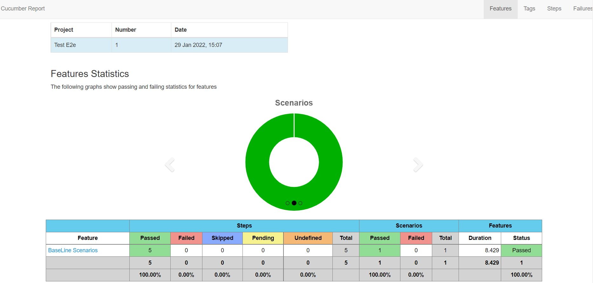

# Automation Test with Cucumber, TestNG and Selenium

### Configure local environment
Tests are configured to run with Chrome. Chrome driver is present in `/src/resources/driver/chromedriver.exe`

### Run Tests
- `mvn clean install -Dbrowser=chrome -Dmode=local -Denvironment=local -DsuiteXmlFile=E2e_test.xml`

### Test results
On build complete, result will be present in: `../target/results/cucumber-maven-reports/cucumber-html-reports/overview-features.html`.
The output will look like this:  

### Full Enterprise Infrastructure

### Links
[Video Tutorial for Project structure](https://www.youtube.com/watch?v=7teAbPGyq2I)